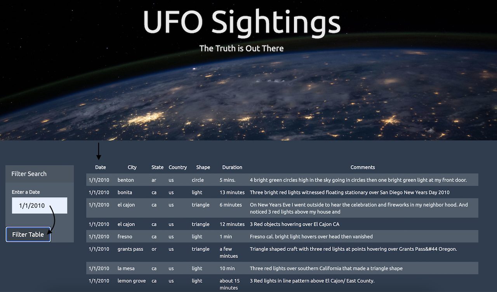
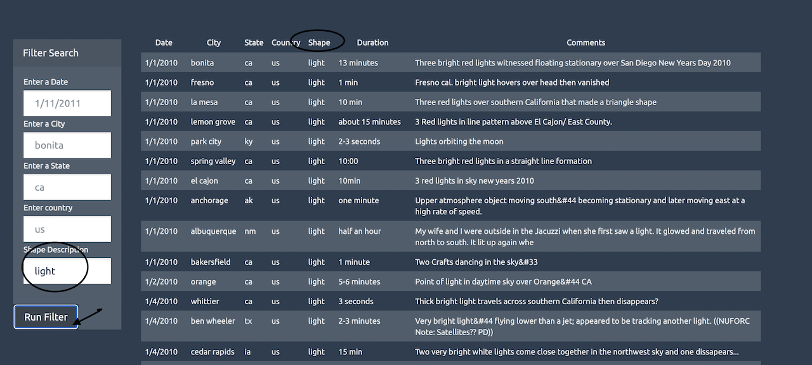

#JavaScript and DOM Manipulation

## Scenario

UFO Sighting Data folder consists of a collection of all of the eye-witness reports. The goal is put this information online for the world to see.

There is just one tiny problem though -- our collection is too large to search through manually. Even our most dedicated followers are complaining that they are having trouble locating specific reports in this mess.

Therefore, I write codes that will create a table dynamically based upon a [dataset](StarterCode/static/js/data.js). That will also allow our users to filter the table data for specific values. 

# In this project, I use below technologies/libraries

  - JavaScript
  - HTML
  - CSS
  - D3.js
 

### Technique 1: Automatic Table and Date Search

* Made column for `date/time`, `city`, `state`, `country`, `shape`, and `comment` 

* Used a date form in HTML document and write JavaScript code that will listen for events and search through the `date/time` column to find rows that match user input.

### Technique 2: Multiple Search Categories

* Used multiple `input` tags and/or select dropdowns, wrote JavaScript code so the user can to set multiple filters and search for UFO sightings using the following criteria based on the table columns:

  1. `date/time`
  2. `city`
  3. `state`
  4. `country`
  5. `shape`

- - -

### Dataset

* [UFO Sightings Data](StarterCode/static/js/data.js)

- - -

- - -

### Alicia Ly
